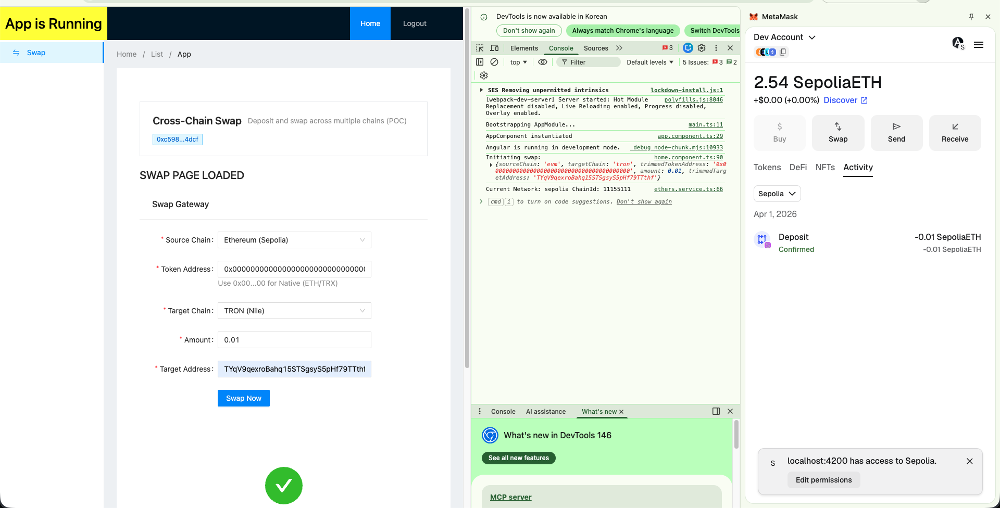
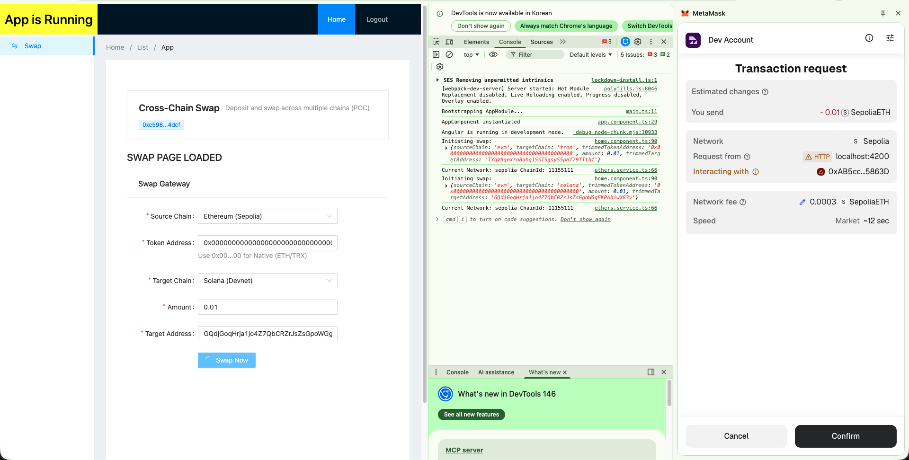
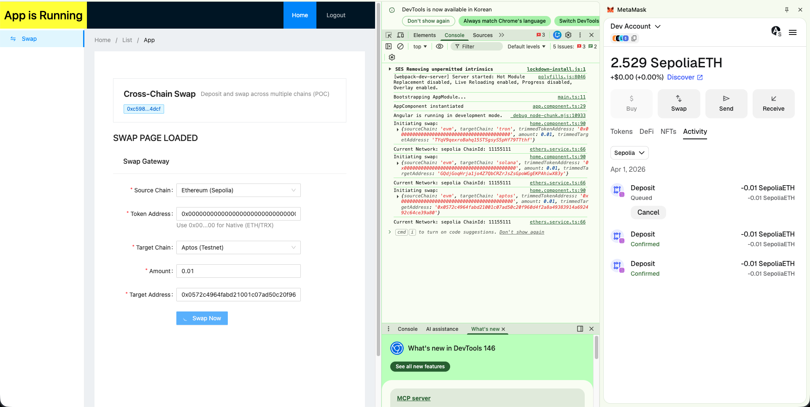

# Multi-Chain Swap Gateway POC

이 프로젝트는 EVM(Sepolia), TRON(Nile), Solana(Devnet), Aptos(Testnet) 간의 교차 체인 스왑 기능을 검증하기 위한 Proof of Concept (POC)입니다.

## 🚀 주요 기능

1.  **멀티 체인 입금 게이트웨이**: 4개 체인(EVM, TRON, Solana, Aptos)에 최적화된 스마트 컨트랙트 제공.
2.  **Native & Token 스왑 지원**: ETH/TRX 등 네이티브 코인뿐만 아니라 ERC-20/TRC-20 토큰 스왑 가능.
3.  **통합 프론트엔드**: Angular 기반의 UI에서 메타마스크, 트론링크, 팬텀, 페트라 지갑을 모두 지원.
4.  **자동화된 솔버(Solver)**: 소스 체인의 입금 이벤트를 감지하여 목적지 체인의 상태를 자동으로 업데이트하는 릴레이어 포함.
5.  **상태 관리**: JSON 기반의 로컬 DB를 사용하여 중복 처리 방지.

## 📸 스크린샷

| TRON (Nile) | Solana (Devnet) | Aptos (Testnet) |
| :---: | :---: | :---: |
|  |  |  |

---

## 🧠 기술적 도전 과제 및 해결 방안

이 교차 체인 POC를 개발하는 과정에서 각 체인별로 발생한 기술적 난관과 이를 해결한 방법은 다음과 같습니다:

### 1. Ethereum (EVM / Sepolia)
*   **문제**: 퍼블릭 RPC 노드(예: PublicNode, Infura)는 부하 방지를 위해 이벤트 필터를 수시로 삭제하며, 이로 인해 `ethers.js`에서 "filter not found" 에러가 빈번하게 발생함.
*   **해결**: **수동 폴링(Manual Polling) 전략** 도입. `contract.on()` 대신 리레이어가 마지막 처리 블록 번호를 추적하고, 10초마다 `queryFilter()`를 호출하여 이벤트를 직접 조회하도록 수정.
*   **문제**: 최신 빌드 도구(Angular 21의 Esbuild)는 Node.js 폴리필을 포함하지 않으나, `ethers.js` 등 블록체인 SDK는 `Buffer`, `global`, `process` 변수를 필수적으로 요구함.
*   **해결**: `src/polyfills.ts`에 해당 전역 변수들을 수동으로 주입하고 `buffer` 패키지를 설치하여 브라우저 호환성 확보.

### 2. TRON (Nile)
*   **문제**: TRON 주소는 Base58(`T...`)과 Hex(`41...`) 두 형식이 혼재되어 있으며, 이를 잘못 혼용할 경우 컨트랙트 호출이 실패함.
*   **해결**: 프론트엔드와 설정 파일에서는 **Base58** 형식을 표준으로 사용하고, Solidity 코드 내부에서만 `address` 타입을 처리하도록 로직을 통일함.
*   **문제**: Hardhat의 ESM 요구사항(`"type": "module"`)과 TronBox의 CommonJS 요구사항(`require`) 간의 의존성 충돌 발생.
*   **해결**: 컨트랙트 환경 분리. 각 체인 폴더(`contracts/evm`, `contracts/tron`)가 자체적인 `package.json`과 설정을 가지도록 독립된 패키지 구조로 재편.

### 3. Solana (Devnet)
*   **문제**: EVM과 달리 솔라나는 기본적으로 "인덱싱된 이벤트" 개념이 없어 리레이어가 프로그램 활동을 감시하기 어려움.
*   **해결**: **정형화된 로깅(Structured Logging)** 구현. Rust 프로그램에서 `msg!` 매크로를 통해 특정 패턴(`Deposited: {amount}, {target}, ...`)의 로그를 남기고, 솔버에서 `connection.onLogs()`와 정규표현식(Regex)을 사용하여 실시간으로 데이터를 파싱함.
*   **문제**: Anchor와 같은 고수준 프레임워크 없이 순수 인스트럭션 데이터 인코딩 필요.
*   **해결**: TypeScript에서 **Borsh 호환 버퍼 인코더**를 직접 구현하여 `U64`(Little Endian) 및 `String`(길이 + 바이트) 직렬화 로직을 완성함.

### 4. Aptos (Devnet)
*   **문제**: 앱토스는 엄격한 **리소스 안전성(Resource Safety)**을 강제함. 구조체 레이아웃을 변경(예: 이벤트 핸들 추가)하면 `BACKWARD_INCOMPATIBLE_MODULE_UPDATE` 에러가 발생하며 업데이트가 차단됨.
*   **해결**: 개발 단계에서는 모듈 이름에 버전을 명시(`swap_gateway_v2`)하여 새 모듈로 게시하고, 배포 전 데이터 구조를 확정해야 함을 확인.
*   **문제**: SDK v6에서 특정 모듈 이벤트를 가져오는 API의 일관성 부족 및 인덱서 지연 문제.
*   **해결**: **리소스 폴링(Resource Polling)** 방식으로 전환. 리레이어가 `getAccountResource`를 통해 `Gateway`의 전체 상태를 읽어오고, `deposits` 벡터의 길이를 비교하여 새 트랜잭션을 감지함으로써 인덱서 상태와 관계없이 100% 신뢰성 확보.

---

## 📂 프로젝트 구조

```text
.
├── contracts/              # 스마트 컨트랙트 소스 코드
│   ├── evm/                # Hardhat 환경 (Sepolia)
│   │   ├── contracts/      # Solidity 소스
│   │   ├── scripts/        # 배포 스크립트 (.js)
│   │   └── package.json    # 독립된 EVM 의존성 (ESM)
│   ├── tron/               # TronBox 환경 (Nile)
│   │   ├── contracts/      # Solidity 소스
│   │   ├── migrations/     # 배포 스크립트
│   │   └── tronbox.js      # TRON 설정
│   ├── solana/             # Rust/Cargo 환경 (Local/Devnet)
│   │   └── lib.rs          # Solana 프로그램 로직
│   └── aptos/              # Move 환경 (Devnet)
│       ├── sources/        # Move 소스
│       └── Move.toml       # Aptos 설정
├── scripts/                # 오프체인 릴레이어
│   ├── solver.ts           # 통합 4개 체인 이벤트 와쳐 & 릴레이어
│   └── processed_deposits.json # 릴레이어 상태 DB
├── src/app/                # Angular 프론트엔드
│   ├── modules/swap/       # 메인 스왑 UI
│   └── @shared/services/   # 블록체인 통신 로직 (ethers, tron, solana, aptos)
└── Makefile                # 주요 명령어 자동화 (Centralized)
```

---

## 🛠 Solana 로컬 개발 환경 설정


1.  **의존성 설치**:
    ```bash
    make install
    ```

2.  **.env 파일 설정**:
    루트 폴더의 `.env` 파일을 자신의 지갑 개인키와 RPC URL로 수정하세요.
    ```env
    SEPOLIA_RPC_URL=https://sepolia.infura.io/v3/your_project_id
    SEPOLIA_PRIVATE_KEY=your_private_key
    SEPOLIA_CONTRACT_ADDRESS=0x...

    TRON_PRIVATE_KEY=your_private_key
    TRON_API_KEY=your_trongrid_api_key
3. **설정값 가져오는 방법 (테스트넷 vs. 메인넷)**:

| 항목 | **테스트넷 (개발용)** | **메인넷 (프로덕션)** |
| :--- | :--- | :--- |
| **EVM RPC URL** | [Infura](https://infura.io) (Sepolia) | [Infura](https://infura.io) (Mainnet) |
| **TRON Host** | `https://nile.trongrid.io` (Nile) | `https://api.trongrid.io` (Mainnet) |
| **Solana RPC** | `https://api.devnet.solana.com` | `https://api.mainnet-beta.solana.com` |
| **Aptos Node** | `https://fullnode.testnet.aptoslabs.com/v1` | `https://fullnode.mainnet.aptoslabs.com/v1` |
| **Private Key** | **테스트용 지갑** 사용 권장 | **하드웨어 월렛** 등 보안 강화 |

*   **테스트 코인 받기**:
    *   **Sepolia ETH**: [Alchemy Faucet](https://sepoliafaucet.com/).
    *   **TRON Nile TRX**: [Nile Faucet](https://nileex.io/join/get_faucet).
    *   **Solana Devnet**: [Solana Faucet](https://faucet.solana.com/).                                     │
    *   **Aptos Testnet**: [Aptos Faucet](https://aptoslabs.com/developers/faucet).
*   **개인키 추출 방법**:
    *   **⚠️ 보안 주의사항**: 개인키는 메인넷과 테스트넷에서 동일하게 작동합니다. 만약 개인키가 노출되면 메인넷에 있는 **실제 자산**이 도난당할 수 있습니다.
    *   **권장 사항**: 지갑(메타마스크, 팬텀 등)에서 **반드시 '새 계정 생성'**을 눌러 개발 전용 계정을 따로 만드세요. 실제 돈이 들어있는 계정은 절대 개발에 사용하지 마세요.
    *   **MetaMask (EVM)**: 메타마스크 실행 -> 우측 상단 계정 아이콘 클릭 -> '계정 추가' -> 이름을 '개발용'으로 설정 후 개인키 추출.
    *   **TronLink (TRON)**: 트론링크 실행 -> '+' 아이콘 클릭 -> 'Create Wallet' -> '개발용' 계정 생성 후 개인키 추출.
    *   **솔라나 (Devnet)**: 팬텀 지갑 설정 -> 계정 관리 -> '지갑 추가/연결' -> '새 계정 생성'.
    *   **앱토스 (Testnet)**: Petra 지갑 설정 -> Manage Account -> 'Add Account' -> 'Create New Account'.
*   **배포 후 계약 주소 및 프로그램 ID 확인 방법**:
    *   **SEPOLIA_CONTRACT_ADDRESS**: `make deploy-evm` 실행 후 터미널에 출력되는 `Contract Address: 0x...`를 확인하세요.
    *   **TRON_CONTRACT_ADDRESS**: `make deploy-tron` 실행 후 TronBox의 마이그레이션 결과에 나오는 주소를 확인하세요.
    *   **SOLANA_PROGRAM_ID**: `make deploy-solana` 실행 후 터미널에 출력되는 `Program Id: ...`를 확인하세요.
    *   **SOLANA_STATE_ACCOUNT**: 프로그램 데이터를 저장할 계정이 필요합니다. `solana-keygen new -o state-keypair.json`으로 키파일을 생성한 후, 그 공개키(`solana-keygen pubkey state-keypair.json`)를 사용하세요.
    *   **APTOS_CONTRACT_ADDRESS**: `make deploy-aptos` 실행 시 사용된 계정 주소(모듈을 게시한 본인 계정)가 계약 주소가 됩니다.
*   *⚠️ 주의: 개인키는 절대 타인에게 공유하거나 소스 코드에 커밋하지 마세요.*

---

## 🛠 Solana 로컬 개발 환경 설정

솔라나 Devnet 파우셋(Faucet) 이용이 원활하지 않을 경우, `solana-test-validator`를 사용하여 로컬에서 개발 및 테스트가 가능합니다.

1.  **로컬 밸리데이터 실행**:
    새 터미널을 열고 다음 명령어를 실행합니다:
    ```bash
    solana-test-validator
    ```
    *개발이 진행되는 동안 이 터미널을 계속 켜두어야 합니다.*

2.  **CLI 설정을 Localhost로 변경**:
    ```bash
    solana config set --url localhost
    ```

3.  **로컬 SOL 에어드랍**:
    ```bash
    solana airdrop 100
    ```

4.  **.env 파일 업데이트**:
    ```env
    SOLANA_RPC_URL=http://127.0.0.1:8899
    SOLANA_NETWORK= # 빈값으로 두면 RPC_URL을 사용합니다
    ```

5.  **로컬 배포 실행**:
    ```bash
    make deploy-solana
    ```
    *참고: `make deploy-solana` 명령어는 현재 CLI 설정(localhost)을 기반으로 동작하도록 구성되어 있습니다.*

---

## 🚢 배포 방법 (Smart Contracts)

### 1. EVM (Sepolia) 배포
```bash
make deploy-evm
```

### 2. TRON (Nile) 배포
```bash
make deploy-tron
```

### 3. Solana (Devnet) 배포
*실행 전 [Solana CLI](https://docs.solanalabs.com/cli/install)와 Rust/Cargo가 설치되어 있어야 합니다 (설치: `sh -c "$(curl -sSfL https://release.solana.com/stable/install)"`).*
```bash
make deploy-solana
```

### 4. Aptos (Testnet) 배포
*실행 전 [Aptos CLI](https://aptos.dev/tools/aptos-cli/install-cli/)가 설치되어 있어야 합니다 (macOS: `brew install aptos`).*
```bash
make deploy-aptos
```

*배포 후 출력된 주소를 `.env` 파일과 `src/app/modules/swap/components/home/home.component.ts`의 `contractAddresses` 객체에 업데이트하세요.*

---

## 💻 사용 및 테스트 방법

### 1. 프론트엔드 실행
```bash
npm start
```
*   `http://localhost:4200/swap` 접속.
*   지갑(MetaMask, TronLink 등)을 연결하고 대상 체인, 토큰 주소, 금액을 입력 후 **Swap Now** 클릭.

### 2. 솔버(Solver) 실행
사용자가 입금을 완료하면, 솔버가 이를 감지하고 목적지 체인에서 처리를 완료합니다.
```bash
make solve
```
*   와쳐가 `Deposited` 이벤트를 실시간으로 스캔합니다.
*   이벤트 감지 시 목적지 체인의 `markProcessed` 함수를 자동 호출합니다.
*   처리된 내역은 `scripts/processed_deposits.json`에 저장되어 중복 처리를 방지합니다.

### 3. 토큰 스왑 테스트 (ERC-20/TRC-20)
*   네이티브 코인(ETH/TRX)을 보낼 때는 Token Address 칸에 `0x00...00` (기본값)을 입력합니다.
*   특정 토큰을 스왑할 때는 해당 테스트넷의 토큰 컨트랙트 주소를 입력하세요. (솔버가 자동으로 `approve`와 `transferFrom` 로직을 처리합니다.)

---

## ⚠️ 주의 사항

*   이 프로젝트는 **테스트넷 전용**입니다. 메인넷에서 사용하지 마세요.
*   솔버를 실행하는 지갑에는 각 체인의 가스비(ETH, TRX)가 충분히 있어야 합니다.
*   Solana와 Aptos의 온체인 프로그램은 `contracts/` 폴더의 소스를 참고하여 별도로 배포해야 합니다. (EVM/TRON 위주로 자동화되어 있습니다.)
